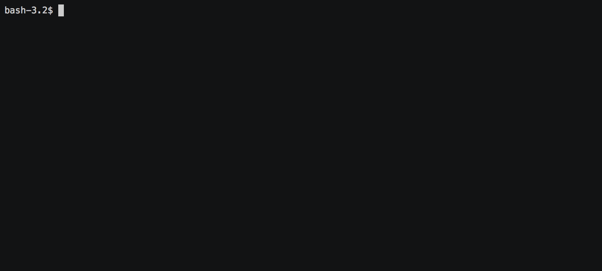

### iotc - iot compiler tooling for arduino && arm mbed

**reason** : IOT compiler toolchains have many moving parts and configurations.
Cross compiling tools are `mostly` platform specific.

**motto** : Improve developer productivity by providing all the cross compile
capabilities on user's favorite OS. Make installation and usage process painless.

**status** : It works but needs more work (see issues). If it doesn't work for
you, create an issue please. (seriously!)

#### See it in action ?



#### Requirement

Install [Docker](https://docs.docker.com/install/) for your OS.

#### How to install

```
npm install -g @azure-iot/iotc
```

#### Use

```
usage: iotc <cmd> [options]

  commands:

  help                                     :  display available options
  version                                  :  show version
  update                                   :  update base container to latest
                                           :
  init <path>                              :  initialize target toolchain on given path (needs iotc.json)
  compile <path>                           :  compile given path (needs iotc.json)
  clean <path>                             :  clean given path (needs iotc.json)
  run <cmd>                                :  run command on the target system
  mbed <args>                              :  run mbed cli with given args
  arduino <args>                           :  run arduino cli with given args

  example:

    init && compile:
            iotc init && iotc compile

            iotc.json --> { "toolchain": "arduino",
                            "target": "AZ3166:stm32f4:MXCHIP_AZ3166",
                            "filename": "sample.ino"
                            }

            iotc.json --> { "toolchain": "mbed",
                            "target": "nucleo_l476rg",
                            "lib":
                              [
                                {
                                  "name": "NDefLib",
                                  "target" : "https://developer.mbed.org/teams/ST/code/NDefLib/#31f727872290"
                                }
                              ]
                          }

            CAUTION: target / toolchain names are case sensitive
            more at:	   https://aka.ms/iotc-boards

  OTHER examples
    run:
            iotc run make
    mbed:
            iotc mbed target -S
    arduino:
            iotc arduino --install-boards AZ3166:stm32f4
```

#### Target Board Names

`ARM mbed` target names are available from `https://os.mbed.com/`. Simply find
your board there and on the same page you will find the `TARGET NAME` for that board.

`Arduino` target names might be a bit more tricky to find but the list below
should help for starters;

```
arduino:avr:uno
arduino:avr:yun
arduino:avr:diecimila
arduino:avr:nano
arduino:avr:mega
arduino:avr:megaADK
arduino:avr:leonardo
arduino:avr:micro
arduino:avr:esplora
arduino:avr:mini
arduino:avr:ethernet
arduino:avr:fio
arduino:avr:bt
arduino:avr:LilyPadUSB
arduino:avr:lilypad
arduino:avr:pro
arduino:avr:atmegang
arduino:avr:robotControl
arduino:avr:robotMotor
arduino:sam:arduino_due_x_dbg
arduino:sam:arduino_due_x
arduino:avr:tinyg
```

MXCHIP AZ3166
```
AZ3166:stm32f4:MXCHIP_AZ3166
```

#### How your project folder structure should look like?

However your structure was for ARMmbed or Arduino.. Keep it the same!
If you are just starting and don't have a particular structure, please visit
their websites and see the sample projects.

#### How containers are managed ?

`iotc` creates a sub container that is tailored for your project and depend on
`azureiot/iotc` container.

In order to benefit from docker caching, name approach below is used.

`aiot_iotc_` `folder_ino`

i.e. `aiot_iotc_7396162`

#### How should I clean up the containers ?

Try pruning! -> https://docs.docker.com/config/pruning/

#### Contributing

Please run the tests under the `test` folder and see if your changes are okay!

```
cd test && node runtests.js
```

This project welcomes contributions and suggestions.  Most contributions require
you to agree to a Contributor License Agreement (CLA) declaring that you have the
right to, and actually do, grant us the rights to use your contribution. For details,
visit https://cla.microsoft.com.

When you submit a pull request, a CLA-bot will automatically determine whether
you need to provide a CLA and decorate the PR appropriately (e.g., label, comment).
Simply follow the instructions provided by the bot. You will only need to do this
once across all repos using our CLA.

This project has adopted the [Microsoft Open Source Code of Conduct](https://opensource.microsoft.com/codeofconduct/).
For more information see the [Code of Conduct FAQ](https://opensource.microsoft.com/codeofconduct/faq/) or
contact [opencode@microsoft.com](mailto:opencode@microsoft.com) with any additional questions or comments.

#### Reporting Security Issues

Security issues and bugs should be reported privately, via email, to the Microsoft
Security Response Center (MSRC) at [secure@microsoft.com](mailto:secure@microsoft.com).
You should receive a response within 24 hours. If for some reason you do not,
please follow up via email to ensure we received your original message. Further
information, including the [MSRC PGP](https://technet.microsoft.com/en-us/security/dn606155)
key, can be found in the [Security TechCenter](https://technet.microsoft.com/en-us/security/default).

#### LICENSE

MIT